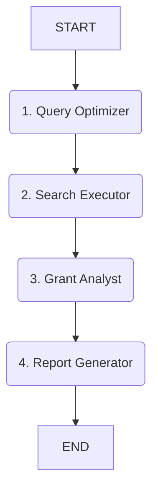

# AI Agent: Vyhľadávač grantov pre humanitné vedy (LangGraph)

Tento projekt je riešením praktického cvičenia v rámci kurzu AI Agentov (Lekcia 7). Cieľom bolo vytvoriť AI agenta, ktorý využíva nástroje na vyhľadávanie, triedenie a vysvetľovanie existujúcich projektových a grantových výziev relevantných pre humanitné vedy (teológia, filozofia, etika, religionistika) na Slovensku, v EÚ a globálne.

## Popis riešenia

Agent je postavený na frameworku **LangGraph**, ktorý umožňuje definovať komplexné workflowy ako stavový graf. Využíva model **GPT-4o** od OpenAI pre analýzu a generovanie textu a nástroj **Tavily Search API** pre prístup k aktuálnym informáciám na internete.

Kľúčovou technikou je **Structured Output** (pomocou Pydantic modelov), čo zabezpečuje vysokú spoľahlivosť pri extrakcii dát. Projekt zahŕňa profesionálny logging, testovanie komponentov a podporu pre Docker.

### Architektúra (Workflow)

Workflow agenta pozostáva zo štyroch krokov (uzlov):

1.  **Query Optimizer:** Transformuje požiadavku používateľa na sériu cielených vyhľadávacích dopytov (SK/EN).
2.  **Search Executor:** Spustí dopyty pomocou Tavily a zozbiera surové výsledky.
3.  **Grant Analyst:** Analyzuje výsledky, filtruje relevanciu a extrahuje kľúčové dáta do štruktúrovaného formátu.
4.  **Report Generator:** Vytvorí finálny prehľadný report v slovenčine (Markdown).



## Inštalácia a spustenie (Lokálne)

### Predpoklady

* Python 3.10+ (Odporúča sa 3.11)
* OpenAI API kľúč (s prístupom ku GPT-4o)
* Tavily API kľúč

### Postup

1.  **Klonovanie repozitára:**

    ```bash
    git clone [https://github.com/vas-repozitar/grant_finder_agent.git](https://github.com/vas-repozitar/grant_finder_agent.git)
    cd grant_finder_agent
    ```

2.  **Vytvorenie a aktivácia virtuálneho prostredia:**

    ```bash
    python3 -m venv venv
    source venv/bin/activate
    # Na Windows: .\venv\Scripts\activate
    ```

3.  **Inštalácia závislostí:**

    ```bash
    pip install -r requirements.txt
    ```

4.  **Konfigurácia API kľúčov:**
    Skopírujte `.env.example` do `.env` a doplňte svoje kľúče.

    ```bash
    cp .env.example .env
    ```

5.  **Overenie nastavenia (Testy):**
    Spustite testy, aby ste overili, že API kľúče a základné komponenty fungujú správne.

    ```bash
    python3 test_agent.py
    ```

6.  **Spustenie agenta:**

    Spustenie s predvoleným testovacím dopytom:

    ```bash
    python3 src/main.py
    ```

    Spustenie s vlastným dopytom:

    ```bash
    python3 src/main.py "Granty pre digitálnu religionistiku 2025"
    ```

Logy z behu agenta sa ukladajú do adresára `logs/`.

## Príklad použitia a výstupu

### Vstup

```bash
python3 src/main.py "Granty pre výskum etiky AI v kontexte kresťanskej filozofie"
```

### Výstup (Skrátený príklad)

```markdown
# Prehľad grantových príležitostí pre: "Granty pre výskum etiky AI v kontexte kresťanskej filozofie"

Našiel som 3 relevantné otvorené výzvy. Tu je ich podrobný prehľad:

---

## Horizon Europe - Ethics of AI and Robotics
*   **Región:** EU
*   **Poskytovateľ:** European Commission - Horizon Europe
*   **Deadline:** 🗓️ 15. marec 2026
*   **Zameranie a relevancia:** Výzva špecificky hľadá interdisciplinárne projekty kombinujúce filozofické a teologické perspektívy s technológiou AI.
*   **Odkaz:** [https://ec.europa.eu/funding/example-link/](https://ec.europa.eu/funding/example-link/)...

---

## APVV Všeobecná výzva 2025
*   **Región:** Slovakia
*   **Poskytovateľ:** APVV
*   **Deadline:** 🗓️ 30. november 2025
*   **Zameranie a relevancia:** V rámci humanitných vied je možné podať projekt zameraný na filozofické aspekty nových technológií.
*   **Odkaz:** [https://www.apvv.sk/example-link/](https://www.apvv.sk/example-link/)...

---
*Poznámka: Odporúčam vždy skontrolovať detaily a podmienky priamo na oficiálnej stránke výzvy.*
```

## Spustenie cez Docker

Projekt obsahuje `Dockerfile` pre jednoduché spustenie v kontajneri.

1.  **Zostavenie obrazu:**

    ```bash
    docker build -t grant-finder-agent .
    ```

2.  **Spustenie kontajnera:**
    Musíte odovzdať API kľúče. Najjednoduchšie je použiť lokálny `.env` súbor pomocou `--env-file`.

    ```bash
    # Spustenie s predvoleným dopytom
    # -it pre interaktívny režim, --rm pre automatické odstránenie kontajnera
    docker run -it --rm --env-file .env grant-finder-agent
    
    # Spustenie s vlastným dopytom ako argumentom
    docker run -it --rm --env-file .env grant-finder-agent python3 src/main.py "Váš dopyt tu"
    ```

## Štruktúra projektu

```
.
├── Dockerfile
├── README.md
├── requirements.txt
├── test_agent.py       # Testy komponentov
├── logs/               # Ukladanie logov
└── src/
    ├── agent/
    │   ├── models.py   # Pydantic modely a definícia stavu
    │   ├── nodes.py    # Implementácia uzlov
    │   └── graph.py    # Definícia LangGraphu
    ├── config.py       # Konfigurácia LLM a nástrojov
    ├── logger.py       # Nastavenie loggingu
    └── main.py         # Vstupný bod aplikácie
```
